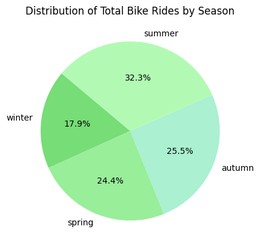
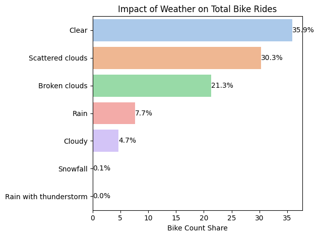
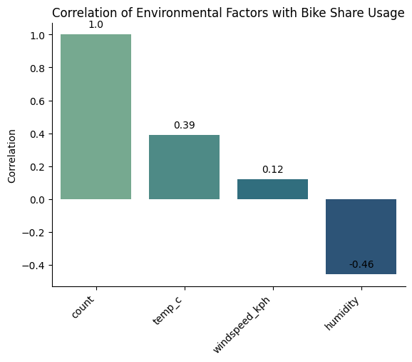
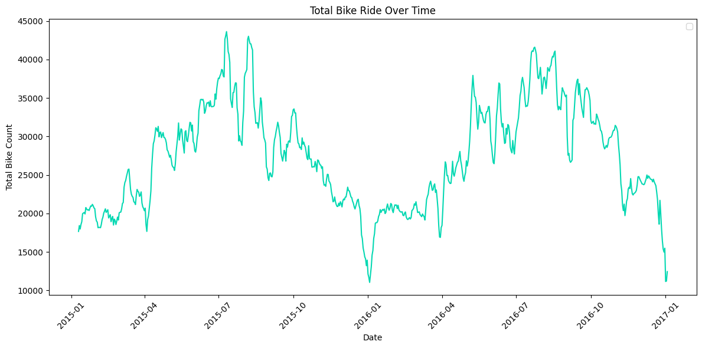
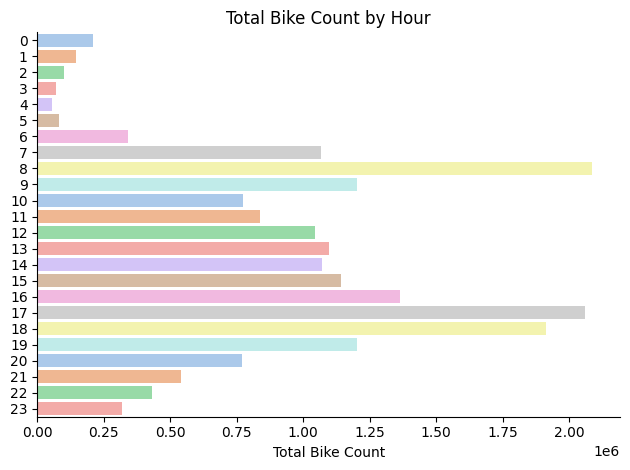

# City Bike Ride Share 
## EDA & Data Visualisation for bike sharing in London

Bike-sharing systems are getting popular especially among big cities around the world. The system helps to promote eco-friendly mode of travel by lowering carbon emission, reduce traffic congestion, and encourage healthy lifestyles. 

This project was created out of a desire to navigate and understand how the trend of bike-sharing system in London throughout the period from 2015 to 2017. It delves into the count of bike share over the year and how a few variables that might affect the total count. All of this to help businesses optimize operations, improve customer experiences, and make strategic decisions.

### Key pain point?
One of the departments want to know the trend of bike ride share in London over the span of 3 years from 2015-2017. 
This is mainly to;
- improve inventory management by providing the right number of bikes at the right time, reducing operational costs. 
- Implement predictive maintenance on bikes, scheduling repairs and checks during low-demand periods.
- Whether company should partner with local businesses to offer services like waterproof covers or gear rentals on different weather conditions.


### Data Source
The data sourced from Kaggle Dataset: London bike sharing dataset
by Hristo Mavrodiev which provides a foundation for my analysis, containing detailed information on count of bike share, timestamp, temperature, season, windspeed, and humidity. 


## The Question
Through a series of Python scripts, I explore a few key questions that I want to answer in this project.

1. How the season changes impact the sum of bike share 
2. Does the weather gives effect on the sum of bike share
3. Correlation between temperature and windspeed 
4. How the bike ride share change over time
4. What is the peak bussiness hour?


# Data Preparation and Cleanup

```python
# Importing Libraries
import ast
import pandas as pd
import seaborn as sns
import matplotlib.pyplot as plt  
import zipfile
import kaggle

# download dataset from kaggle using the Kaggle API
!kaggle datasets download -d hmavrodiev/london-bike-sharing-dataset

# extract the file from the downloaded zip file
zipfile_name = 'london-bike-sharing-dataset.zip'
with zipfile.ZipFile(zipfile_name, 'r') as file:
    file.extractall()

# read in the csv file as a pandas dataframe
bikes = pd.read_csv("london_merged.csv")
```

## Important Metadata

- "timestamp" - timestamp field for grouping the data
- "cnt" - the count of a new bike shares
- "t1" - real temperature in C
- "t2" - temperature in C "feels like"
- "hum" - humidity in percentage
- "windspeed" - wind speed in km/h
- "weathercode" - category of the weather
- "isholiday" - boolean field - 1 holiday / 0 non holiday
- "isweekend" - boolean field - 1 if the day is weekend
- "season" - category field meteorological seasons: 
    - -- 0-spring ; 1-summer; 2-fall; 3-winter.
- "weather_code" category description:

    - -- 1 = Clear ; mostly clear but have some values with haze/fog/patches of fog/ fog in vicinity 
    - -- 2 = scattered clouds / few clouds 
    - -- 3 = Broken clouds 
    - -- 4 = Cloudy 
    - -- 7 = Rain/ light Rain shower
    - -- 10 = rain with thunderstorm 
    - -- 26 = snowfall 
    - -- 94 = Freezing Fog

## Data exploration notes

This is where the data inspection were done, wheter there's an errors, inconcsistencies, bugs, weird or any corrupted characters etc that should be corrected.

1. Make sure there's no null or NaN value, replace it with significant value if possible.
2. Two temperature columns were seen, need to decide which one is more valueble to be included into the analysis part.
3. From Metadata notes above, we cna detect that weather_code and season columns are numerical value but can be specified as categorical variables
4. The is_holiday and is_weekend columns are  boolean variables
5. Besides timestamp which obviously a date-time object, we can make numerical analysis on the rest of the columns

## Data Cleaning 

The aim is to refine our dataset to ensure it is structured and ready for analysis.

- Only relevant columns should be retained.
- T2 column is dropped as the correlation between T2 and T1 is high
- Season and weather dictionary were created, as to map the integers value to actual and meaningful value.
- Changed the timestamp column datatype, from object to datetime type and make the timestamp as index for easier analysis.
- New column was made for each year, month and day extracted from timestamp column.

View my notebook for detailed steps here:
[london_bike1.ipynb](london_bike1.ipynb)

# The Analysis

You can view my notebook for a detailed breakdown of the steps here:
[london_bike1.ipynb](london_bike1.ipynb)

## 1. Distribution of Total Bike Rides by Season




### Insight 

- Summer: Accounts for the highest proportion of bike rides at 32.3%.
- Autumn: Represents 25.5% of total bike rides.
- Spring: Comprises 24.4% of the rides, close to autumn.
- Winter: Has the lowest share of bike rides at 17.9%.
This indicates that bike rides are most popular in the summer and least popular in the winter.

## 2. Impact of Weather on Total Bike Rides



### Insight 

- 'Clear' weather has the highest bike usage, accounting for 35.9% of the total bike rides followed by 'Scattered clouds' conditions  with 30.3% of the rides occurring under this weather.
- 'Broken clouds' account for 21.3% of the total bike rides, indicating moderate usage.
- While 'Rain' conditions significantly reduce bike rides, contributing only 7.7% to the total, but still higher compared to 'Cloudy' weather which is 4.7%.
- 'Snowfall' and 'Rain with thunderstorms' conditions see negligible bike usage, at 0.1% and 0.0% respectively.
- This suggests that clear and mildly cloudy weather conditions encourage higher bike usage, while adverse weather like rain, snowfall, and thunderstorms greatly reduce bike rides.


## 3. Correlation of Environmental Factors with Bike Share Usage



### Insight 

- Weak Positive correlation for temperature (temp_c) indicates that higher temperatures are generally associated with increased bike usage.
- While for humidity, it also has weak but negative correlation of -0.46 with bike shares, meaning higher humidity tends to reduce the number of bike rides.
- Windspeed (windspeed_kph) has a weak positive correlation of 0.12, suggesting that wind speed has a minimal impact on bike usage.

- Warmer temperatures encourage peopel to use the ride, while higher humidity discourages them.

## 4. Trends in Total Bike Rides Over Time 

Resampling was done to get the sum of ride bike share per day.

```python
# resampling the count column data:  group the 'count' data based on a new frequency, daily bins (one group per day), hence the 'D'
# as the original data recorded bike share multiple times per day, so we want to calculate sum of bike rides per day

daily_counts = bike['count'].resample('D').sum()

# Find the day with the lowest total bike rides
lowest_count = daily_counts.min()
lowest_day = daily_counts.idxmin() #idxmin gives the date corresp to the minimum value.

# Find the day with the highest total bike rides
highest_count = daily_counts.max()
highest_day = daily_counts.idxmax() #idxmax gives the date corresp to the minimum value.

# Print the results
print(f"The lowest bike ride count was {lowest_count} on {lowest_day}.")
print(f"The highest bike ride count was {highest_count} on {highest_day}.")
```
Result shows that:
- The lowest bike ride count was 0 on 2016-09-02.
- The highest bike ride count was 72504 on 2015-07-09.
##



### Insight 

- Seasonal Peaks: Noticeable peaks in bike rides are around the summer months (around June to August) each year, indicating higher usage during warmer seasons.

- Yearly Patterns: The pattern of bike usage shows a repeating cycle, with higher usage in spring and summer, followed by declines in autumn and winter.

## 5. Hourly Bike Ride Patterns: When Do Londoners Ride the Most?



### Insight 

- Morning Peak (7 AM - 9 AM): There is a significant spike in bike usage during the early morning hours, particularly around 8 AM, indicating a high volume of commuters using bikes to get to work.
- Evening Peak (4 PM - 7 PM): Another noticeable increase in bike rides occurs during the late afternoon and early evening, with a peak around 6 PM, suggesting heavy usage for the commute home.
- Low Usage Overnight: Bike usage drops drastically between 12 AM and 5 AM, reflecting minimal activity during these early hours.
- For the time between (12 PM - 1 PM) and (7 PM - 9 PM) Bike usage remains relatively high.

## Discovery
### What did we learn?

We discovered that:

- Seasonal Trends: 
    - Summer is the most popular season for bike rides, with a peak in usage, while winter sees the lowest activity.

- Weather Impact: 
    - Clear skies and scattered clouds are the most favorable weather conditions for biking. Rain, snow, and high humidity significantly reduce bike usage.

- Daily Patterns: 
    - Bike rides peak during the morning (7-9 AM) and evening (4-7 PM) hours, corresponding to typical commuting times.

- Correlation with Environmental Factors: 
    - Temperature positively correlates with bike rides, meaning more people bike when it’s warmer. Conversely, humidity negatively impacts biking, with fewer rides on humid days.

### Recommendations

1. Optimize Bike Availability Based on Seasonal and Daily Trends:
    
    -  Number of bikes should be increase especially during peak seasons (spring and summer) and during high-demand hours (morning and evening commutes). 
    - Operational cost and maintenance needs can be reduced during low-demand periods (winter and late-night hours) by looking at the low total of bike share during that periods.

2. Implement Predictive Maintenance:

    - Major mantainance work should be done during non-peak hour season, which for this case during winter month.
    - Data recorded from each bike should be monitored, for bikes that were heavily used before should be identify and prioritized for maintenance to prevent breakdowns during high-demand periods.

3. Weather-Responsive Services:
    
    - As some users still need to use the bike even during less favorable weather, company can tackle this issue by collaborating with local companies that provide extra services that can make biking more favorable. Such services are waterproof covers, rain gear, or heated seats during colder months.
    
## Conclusion 

This exploration into the London Bike Sharing has been incredibly informative, highlighting the influence of season and weather on total of bike share and the trends of bike sharing over time (daily and hourly).

The insights I got might help the company to optimize operations, improve customer experiences, and make strategic decisions especially regarding the inventory management, maintenance operations and extra services for customer's satisfaction. 
